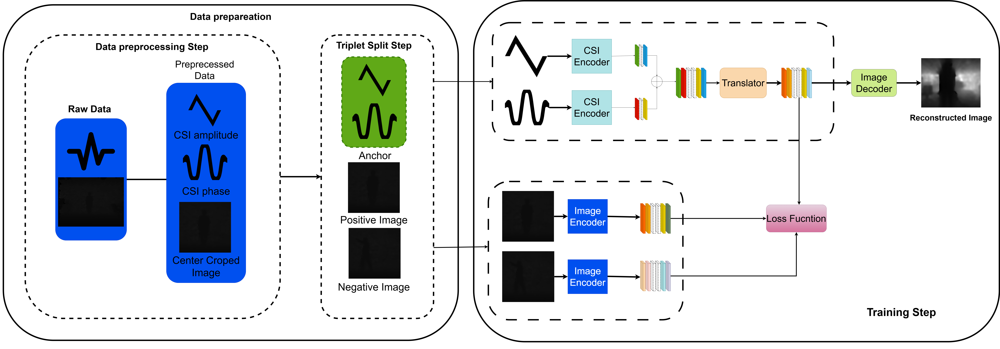

# TRICSIIMAGE AN IMAGE RECONSTRUCTION NETWORK FROM CSI

This document describes the dataset, preprocessing, model architectures, training procedure, evaluation metrics, and reproducibility considerations for a system that (1) reconstructs Channel State Information (CSI) tensors and (2) reconstructs RGB images from learned latent representations. The repository contains PyTorch implementations of the dataset pipeline, encoders, decoders, training loops, and scripts to save and inspect reconstructions.

<p align="center">
  
  <br>
  <i><b>Network Structure</b></i>
</p>

Table of contents
- Abstract
- Dataset organization
- Data preprocessing and normalization
  - NaN and infinite values handling
  - Per-antenna standardization
- Dataset sampling and pair formation
- Model architectures
  - Convolutional building blocks (mathematical notation)
  - CSI encoder and decoder
  - Image encoder and decoder
- Loss functions and training objectives
  - Reconstruction losses
  - Combined objective (if both tasks are trained jointly)
- Training procedure and hyperparameters
- Evaluation metrics and visualization
- Implementation details and reproducibility
- Command-line usage examples
- File and checkpoint layout
- References
- License

---

## Abstract

I learn compact latent representations of CSI and RGB images with convolutional encoder–decoder models. For CSI, the encoder maps short spatiotemporal CSI tensors to a fixed-dimensional latent vector; the decoder reconstructs the original CSI tensor. For RGB images, a separate encoder–decoder pair maps images to and from a latent space. Mean-squared error is used as the primary reconstruction loss. The pipeline includes robust preprocessing to handle NaNs and infinities in CSI `.mat` files and CPU/GPU-aware data loading.

---

## Dataset organization

The expected on-disk layout is:
```
root_dir/
├─ session_01/
│  ├─ action_01/
│  │  ├─ wifi-csi/
│  │  │  ├─ 0001.mat
│  │  │  └─ ...
│  │  └─ rgb/
│  │     ├─ 0001.png
│  │     └─ ...
│  └─ action_02/
│     └─ ...
└─ session_02/
   └─ ...
```

Each `wifi-csi/*.mat` file should contain CSI amplitude and phase arrays (in the provided code, keys `'CSIamp'` and `'CSIphase'` are assumed). For each `.mat` there is a corresponding RGB image in the `rgb/` folder with the same base filename (but `.png` extension). Actions are assumed to be labeled by folder name (e.g., `action_01`).

---

## Data preprocessing and normalization

Let X_amp ∈ R^{C×H×W} denote the CSI amplitude array and X_phase ∈ R^{C×H×W} the CSI phase array, where C is number of antennas / channels and H×W are temporal/spatial dimensions as stored in the .mat file. All preprocessing is applied independently to amplitude and phase.

1) Handling NaN and infinite values

For numerical robustness, all NaN, +∞ and −∞ entries are replaced with finite values:

- NaN values are replaced with 0.
- Positive infinity replaced by a large finite value (implementation uses 1.0).
- Negative infinity replaced by a large negative finite value (implementation uses −1.0).

Formally, for any scalar 
```math
s = X[i],
s ←
\begin{cases}
0 & \text{if } s \text{ is NaN},\\
+1 & \text{if } s = +\infty,\\
-1 & \text{if } s = -\infty,\\
s & \text{otherwise}.
\end{cases}
```
2) Per-channel mean–variance normalization

For each channel (antenna) c, compute empirical mean μ_c and standard deviation σ_c (sample standard deviation). Then standardize:
```math
\hat{X}_{c} = \frac{X_{c} - \mu_c}{\sigma_c + \epsilon},
```

where ε = 1e-8 prevents division by zero. This operation is applied independently for amplitude and phase channels and for each sample in the dataset pipeline function.

Notes:
- The implementation uses numpy to compute statistics per-channel and normalizes each antenna/time-series separately.
- If statistics over the full dataset are desired (instead of per-sample), compute μ_c and σ_c over the entire training set and apply the same normalization at inference time.

---

## Dataset sampling and pair formation

The dataset loader constructs triples:
- (CSI_amp, CSI_phase), positive_image, negative_image

Positive image: the RGB image that corresponds to the same `.mat` file (same base filename).

Negative image: a randomly chosen RGB image whose action label differs from the positive image label. This negative sampling is performed within the Dataset __getitem__ method.

The Dataset class also applies standard RGB transforms:
- Conversion from BGR to RGB (OpenCV → PIL)
- torchvision transforms: ToPILImage → ToTensor → Normalize(mean, std)

Normalization uses ImageNet mean and std by default:
mean = [0.485, 0.456, 0.406], std = [0.229, 0.224, 0.225].

---

## Model architectures (mathematical description)

General notation:
- ```mathx ∈ R^{C×H×W}``` input tensor (C channels, H height, W width)
- ```mathConv2d_{k,f,s,p}(·)``` denotes 2d convolution with kernel size k, f output channels, stride s and padding p.
- ConvTranspose2d is the transposed convolution (deconvolution) operator used for upsampling.
- ```mathBN(·)``` denotes ```mathBatchNorm2d``` and ```mathLN(·)``` denotes LayerNorm.
- ```mathσ(·)``` denotes a nonlinear activation (e.g., ReLU or GELU).
- ```mathLinear(v→d)``` denotes a fully connected layer mapping vector of length v to length d.
- ```mathAdaptiveAvgPool2d((1,1))``` maps spatial dimensions to (1,1) by averaging.

All convolutions are applied with standard bias unless explicitly set otherwise in code.

1) Convolutional building block

A single forward pass for a convolutional block with activation:

```math
y = σ(BN(Conv2d(x))) or y = σ(LN(Conv2d(x)))
``` 
depending on the block.

Batch normalization performs the per-channel affine transformation after standardization. Layer normalization performs normalization over feature dimensions per-sample and is used in the CSI encoder initial layer.

2) CSI encoder

Input: two channels concatenated (amplitude and phase) or three channels if amplitude and phase are stored across multiple antennas. In the provided code the encoder signature expects shape (C, H, W) where C is typically 3 (e.g., 3 antennas or channels).

The encoder applies:
- Layer normalization over the input tensor
- Conv2d(C → 32, k=3, s=1, p=1), GELU
- Conv2d(32 → 64, k=3, s=2, p=1), BatchNorm2d, GELU
- Conv2d(64 → 128, k=3, s=2, p=1), BatchNorm2d, GELU
- Conv2d(128 → 256, k=3, s=2, p=1), BatchNorm2d, GELU
- AdaptiveAvgPool2d((1,1)) → flatten to a 256-d vector
- Linear(256 → d) producing latent vector z ∈ R^{d}

Mathematically, letting f_{enc}^{(i)} be the successive operations, the full encoder is:

```math
z = Linear(Flatten(AdaptiveAvgPool2d( f_{enc}^{(n)}(x) )))
```

3) CSI decoder

Input: latent vector z ∈ R^{d}.

Decoder uses:
- Linear(d → 256×(H/8)×(W/8)) and ReLU
- Reshape into a 3D tensor of shape (256, H/8, W/8)
- ConvTranspose2d(256 → 128, k=4, s=2, p=1) → ReLU
- ConvTranspose2d(128 → 64, k=4, s=2, p=1) → ReLU
- ConvTranspose2d(64 → 32, k=4, s=2, p=1) → ReLU
- Conv2d(32 → C, k=3, p=1) → optionally activation (e.g., identity for regression)
- Final output is interpolated with bilinear upsampling to the target (H, W)

The decoder computes 
```math
\hat{X}_{CSI} = f_{dec}(z)
``` 

The bilinear interpolation ensures exact output shape even when integer divisions are not exact.

4) Image encoder

Input: RGB image tensor x_img ∈ R^{3×H×W} (the code uses 480×640).

Encoder structure:
- Conv2d(3 → 32, k=3, s=2, p=1), BN, ReLU  (→ 32 × H/2 × W/2)
- Conv2d(32 → 64, k=3, s=2, p=1), BN, ReLU (→ 64 × H/4 × W/4)
- Conv2d(64 → 128, k=3, s=2, p=1), BN, ReLU (→ 128 × H/8 × W/8)
- Flatten and Linear(flat_dim → d) producing latent vector z_img ∈ R^{d}

5) Image decoder

Input: z_img ∈ R^{d}
- Linear(d → 256×30×40) (this specific size was chosen in code; it must match the decoder upsampling pipeline)
- Reshape → ConvTranspose blocks to progressively upsample to the target resolution (480×640)
- Final activation: Sigmoid (if the input images are scaled to [0,1]) or identity + appropriate scaling if inputs were normalized.

---

## Loss functions and training objectives

Primary reconstruction objective:

Mean Squared Error (MSE) for a single sample:
```math
L_{MSE}(X, \hat{X}) = \frac{1}{n} \sum_{i=1}^{n} (X_i - \hat{X}_i)^2
```

where n is the number of scalar elements in X.

CSI reconstruction loss:
```math
L_{CSI} = \frac{1}{N} \sum_{j=1}^{N} L_{MSE}(X_{CSI}^{(j)}, \hat{X}_{CSI}^{(j)})
```

Image reconstruction loss:
```math
L_{RGB} = \frac{1}{N} \sum_{j=1}^{N} L_{MSE}(X_{RGB}^{(j)}, \hat{X}_{RGB}^{(j)})
```

If training both tasks jointly, combine with weighting hyperparameters λ_{CSI} and λ_{RGB}:

```math
L_{total} = λ_{CSI} L_{CSI} + λ_{RGB} L_{RGB}.
```

In the provided scripts the CSI training loop optimizes L_{CSI} only and the image training loop optimizes L_{RGB} only (separate phases). Optionally extend to a joint model where both encoders share parameters or have an alignment loss between ```math z_{CSI}``` and ```math z_{RGB}``` (contrastive or L2).

Optional additional losses (recommended experiments)
- Perceptual loss (for RGB): use a pretrained backbone (VGG) to compute feature reconstruction loss.
- SSIM loss: Structural similarity index to encourage perceptual quality.
- Contrastive loss: if the latent representations should be aligned between modalities, use contrastive or triplet losses with positive (matching) and negative (non-matching) pairs.

---

## Training procedure and hyperparameters

Typical hyperparameters used in the provided code:

- CSI reconstruction:
  - Encoder latent dimension d = 256 (configurable)
  - Optimizer: Adam
  - Learning rate: 1e-3
  - Batch size: 8
  - Number of epochs: 20
  - Loss: MSELoss

- RGB reconstruction:
  - Encoder latent dimension d = 256
  - Optimizer: Adam
  - Learning rate: 1e-4
  - Batch size: 8
  - Number of epochs: 20
  - Loss: MSELoss
  - Final output activation: Sigmoid (for [0,1] images)

Checkpointing
- `checkpoints/best_weights.pth`: saved when validation loss improves.
- `checkpoints/last_weights.pth`: saved at the end of every epoch.

Data split
- Example uses sklearn.model_selection.train_test_split with test_size = 0.2 and random_state = 42.

DataLoader settings
- num_workers: 4
- pin_memory: True if using CUDA

Validation and visualization
- During validation, compute the average MSE across the test set.
- Plot channel-wise original vs. reconstructed signals for CSI.
- For images, display original and reconstructed images side-by-side.

---

## Evaluation metrics

Primary quantitative metric:
- Mean Squared Error (MSE) on the test set.

Additional recommended metrics:
- Peak Signal-to-Noise Ratio (PSNR):
  PSNR(X, \hat{X}) = 10 · log_{10}\left( \frac{MAX_I^2}{MSE(X,\hat{X})} \right),
  where MAX_I is the maximum possible pixel/element value (e.g., 1.0 if inputs are in [0,1]).

- Structural Similarity Index (SSIM) for RGB images: evaluates perceived image quality.

- Latent-space inspection: measure cosine similarity or L2 distance between paired and non-paired latents if alignment between modalities is desired.

- Downstream task performance: if the latent representation is used for classification or retrieval, measure classification accuracy or retrieval metrics (mAP, precision@k).

---

Implementation details and reproducibility

- Set seeds to obtain reproducible runs (best-effort):
  - Python random: random.seed(seed)
  - NumPy: np.random.seed(seed)
  - PyTorch CPU: torch.manual_seed(seed)
  - PyTorch CUDA: torch.cuda.manual_seed_all(seed)
  - cudnn deterministic options (may reduce performance): torch.backends.cudnn.deterministic = True; torch.backends.cudnn.benchmark = False

- Device selection:
  - Use `device = torch.device("cuda" if torch.cuda.is_available() else "cpu")`.
  - Ensure tensors and model parameters are moved to the same device.

- Data types:
  - CSI arrays are cast to float32.
  - Image tensors are float32 (normalized) for encoder input; if the decoder uses Sigmoid, training targets must be mapped to [0,1].

- Numerical stability:
  - Add ε = 1e-8 to denominators in standardization to avoid divide-by-zero.
  - Replace NaN/infinite values before normalization.

- Performance considerations:
  - When training on larger images (480×640), memory consumption is significant. Reduce batch size if GPU memory is insufficient.
  - Use mixed precision (torch.cuda.amp) to reduce memory and improve throughput.

---

## Command-line usage examples

Install dependencies (example):
```
pip install -r requirements.txt
```

Train CSI autoencoder (example script name `train_csi.py`):
```
python train_csi.py --root_dir /path/to/dataset --batch_size 8 --epochs 20 --lr 1e-3 --latent_dim 256 --save_dir ./checkpoints
```

Train image autoencoder (example script name `train_image.py`):
```
python train_image.py --root_dir /path/to/dataset --batch_size 8 --epochs 20 --lr 1e-4 --latent_dim 256 --save_dir ./checkpoints
```

Evaluate and visualize reconstructions (example):
```
python evaluate.py --checkpoint ./checkpoints/best_weights.pth --root_dir /path/to/dataset --num_samples 4
```

(Adapt the scripts and argument names to those present in the codebase. The provided code blocks in this repository can be refactored into CLI scripts.)

---

## File and checkpoint layout

- README.md (this file)
- dataset.py (implementation of MMFIDataset)
- train_csi.py (training loop for CSI encoder/decoder)
- train_image.py (training loop for image encoder/decoder)
- models.py (model class definitions)
- utils.py (helper functions: plotting, metrics, data transforms)
- checkpoints/
  - best_weights.pth
  - last_weights.pth

Checkpoint structure (PyTorch state dict example):
```
{
  'epoch': int,
  'encoder_state_dict': encoder.state_dict(),
  'decoder_state_dict': decoder.state_dict(),
  'optimizer_state_dict': optimizer.state_dict(),
  'val_loss': float
}
```

---

## References

- PyTorch documentation: https://pytorch.org
- Wang, Z., Bovik, A. C., Sheikh, H. R., & Simoncelli, E. P. (2004). Image quality assessment: From error visibility to structural similarity. IEEE Transactions on Image Processing.
- He, K., Zhang, X., Ren, S., & Sun, J. (2016). Deep residual learning for image recognition. (Useful background on conv architectures but not directly used.)

---

## Notes and possible extensions

- Joint multimodal training: align CSI and RGB latent spaces using a contrastive or cross-modal reconstruction loss to enable cross-modal generation (e.g., predict RGB from CSI).
- Pretraining: initialize image encoder from a pretrained backbone for better perceptual reconstructions.
- Perceptual losses and adversarial losses can improve visual quality for image reconstruction but require careful hyperparameter tuning.
- Consider normalizing CSI values using dataset-level statistics instead of per-sample standardization when the goal is consistent scaling across train/val/test.

## Contact

For clarifications or issues, open an issue in this repository describing the dataset layout and the error/observation.
